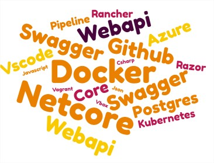
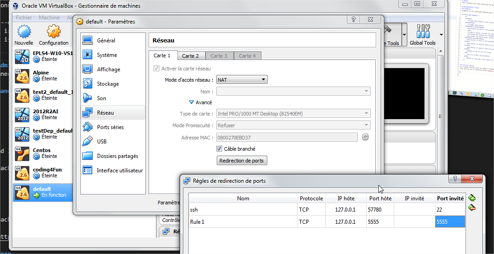
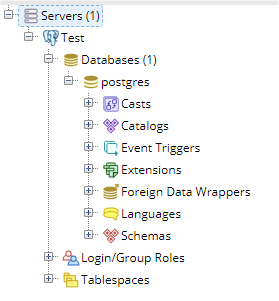

# Coding4Fun.Net
---

# Presentation



---
# Prerequisite
Administrator on windows
laptop (Core i7, 8Go ram)
---
# Step 1 (Environment)

+++

## Proxy configuration
Public Wifi or 4G :(
---

## Docker 
https://docs.docker.com/toolbox/toolbox_install_windows/
- Do not forget to select "git for windows" during the installation
- Launch docker (You should have a shortcut on your desktop))
- You can do a quick test with : 
````
docker run hello-world
````
---
## Visual Studio Code 
https://code.visualstudio.com/
---

## DotNetCore
https://www.microsoft.com/net/learn/get-started-with-dotnet-tutorial
---

## Github
- Create your accout
- Create a repository named Coding4Fun.Net
---

## Step 2 (Backend)

+++

## Creation of a database
For this session, we will use a postgre database : 
https://hub.docker.com/_/postgres/
````
docker run --name some-postgres -d -e POSTGRES_PASSWORD=mysecretpassword -d postgres 
````
+++
## PGAdmin
PGAdmin is the admistration site for PostGres 
https://hub.docker.com/r/dpage/pgadmin4/
````
docker run  -p 5555:80 -e "PGADMIN_DEFAULT_EMAIL=test@test.com" -d -e "PGADMIN_DEFAULT_PASSWORD=password" dpage/pgadmin4
````
---
## Docker network 
Create a network and connect your 2 containers
````
docker network create --driver bridge isolated_nw 
docker network connect isolated_nw yyyy
docker network connect isolated_nw xxxx
````
---
## Configure vbox redirection

---
## Connection with PGAdmin
Now you can try to connect to your DB in PGAdmin
http://your-ip:5555
---
## Configure PGADMIN
You have to retrieve the internal ip of the postgres container 
````
docker inspect some-postres 
````
And you can configure the connection in PGAdmin

---
## Usefull docker command
- docker attach
- docker image
- docker ps
- docker inspect
---
## Create your WebApi
create a src folder and launch this command in this folder
````
dotnet new webapi -o Backend
````
Now, build and test

````
dotnet build
dotnet run 
````
---
## And now create your container
Create a dockerfile for your project
https://docs.docker.com/engine/examples/dotnetcore/ 
---
## And now create your container
Build the image :
````
docker build --no-cache -t backend .  
```` 
## And now create your container
And run it ...
````
docker run -p 80:80 backend   
```` 
## Create your WebApi
````
dotnet new webapi -o Backend
````
Now, build and test (https://localhost:5001/api/Values)
---
## And now as a container
````
dotnet new webapi -o Backend
````
Now, build and test (https://localhost:5001/api/Values)
---

## Persist your data with ef core

 - Follow this guide (https://docs.microsoft.com/en-us/ef/core/get-started/aspnetcore/new-db?tabs=visual-studio)
 - and this link for postgres (http://www.npgsql.org/efcore/)

---

## Annexe
kill all running containers with docker kill $(docker ps -q) 
delete all stopped containers with docker rm $(docker ps -a -q) 
delete all images with docker rmi $(docker images -q) 

--- 

## Docker hub

(https://hub.docker.com/)

---

## Rancher 

- Install vagrant (https://www.vagrantup.com/downloads.html)
- Update powershell (https://docs.microsoft.com/en-us/powershell/scripting/setup/installing-windows-powershell?view=powershell-6)
- Install vagrant-hostmanager ````vagrant plugin install vagrant-hostmanager````
- (https://gitlab.com/mug-in-clermont-public/M6-2018)

---

## Create your WebApi
Install the asp.net authority for development certificate
````
dotnet dev-certs https --trust 
````
---